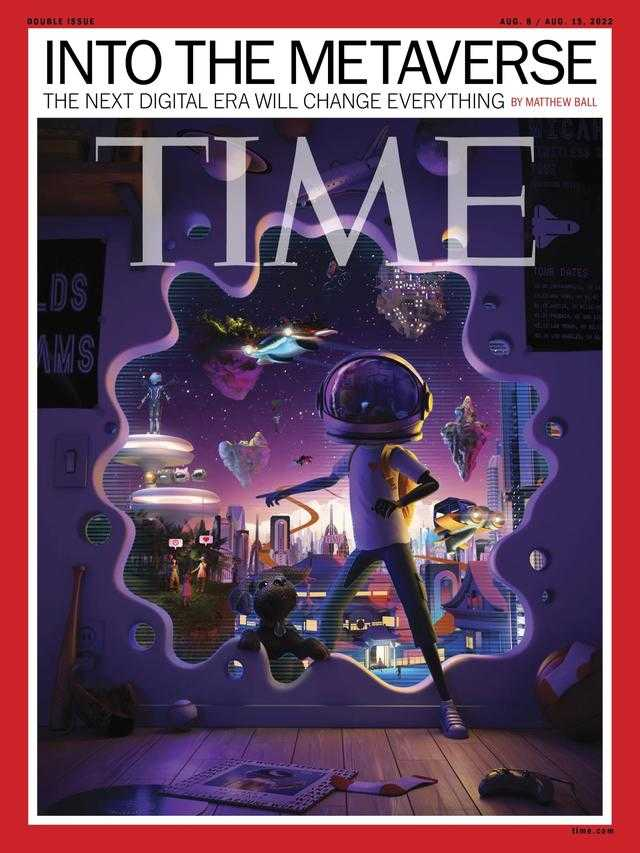

# 《时代》封面：元宇宙将改变生活，但不是对互联网的彻底变革

元宇宙登上了《时代》封面。

　　当地时间7月18日，美国《时代》杂志发布题为《元宇宙将改变世界》的封面文章，作者马修·鲍尔（Matthew Ball）指出，元宇宙正在重塑生活，尽管对社会到底意味着什么还不清楚，科技巨头们对元宇宙没有形成统一的共识，但未来掌握元宇宙的公司将占据主导地位。

马修·鲍尔是知名的元宇宙支持者，也是控股公司Epyllion的CEO，风险投资公司Makers Fund的风险合伙人，曾著有《元宇宙及其将如何彻底改变一切》（《The Metaverse And How it Will Revolutionize Everything》）。

　　从去年开始，元宇宙概念急剧升温。鲍尔在文章中提到，据美国证券交易委员会（SEC）报告，2022年上半年，“元宇宙（metaverse）”一词在监管文件中出现1100多次，去年被提及260次，而此前的二十年中，这一概念只出现过十几次。

　　各大科技巨头进军元宇宙，但未见明显成效

　　引爆元宇宙概念的关键事件，是去年扎克伯格宣布将脸书（Facebook）改名为Meta，除此之外，亚马逊、苹果、谷歌、微软、英伟达、腾讯等科技巨头也不甘示弱，紧锣密鼓地准备着各自的“元宇宙”计划。

　　鲍尔表示，这些公司正在进行内部重组、重构产品设计、并准备推出价值数十亿美元的产品。

　　Meta首席执行官扎克伯格此前称，公司将每年为元宇宙投入100多亿美元。今年1月，微软宣布科技史上最大规模的收购，斥资750亿美元收购游戏巨头动视暴雪（Activision Blizzard），以推进元宇宙计划。

　　根据《纽约时报》报道，苹果也在探究元宇宙产品的可能性，预计于2023年推出MR（混合现实）头显，这是自2015年以来，苹果的首个主要新产品类别。

　　全球知名咨询机构麦肯锡（McKinsey&Company）曾报告称，今年已有超过1200亿美元的投资流向元宇宙；79%的活跃用户在元宇宙进行消费；25%的高管表示，预计未来5年公司收入超15%将来自元宇宙。元宇宙席卷全球，但这一概念对于普通人来说还很遥远，元宇宙产品并未成功问世，也未有公司通过元宇宙获得营收。

　　以Meta为例，更名之初其市值超过9000亿美元，但如今只有约4450亿美元，缩减超50%。该公司的元宇宙部门“现实实验室（Reality Labs）”至今仍在亏损，去年营业亏损超百亿美元，今年一季度亏损30亿美元。

　　元宇宙改变生活方式

　　鲍尔将元宇宙比作“3D互联网”、平行的虚拟世界，其不仅能跨越数字技术，甚至在一定程度上可以影响现实世界。

　　教育、医学、基础设施建设等诸多行业都会收到元宇宙的影响，换句话说，元宇宙能够改变人们的生活方式。

　　教育方面，元宇宙使得“身临其境的教学”成为可能。几十年来，学生只能通过观看阿波罗15号指挥官大卫·斯科特在月球上漫步，学习重力知识。但利用元宇宙塑造的虚拟世界，学生将有可能前往虚拟世界的月球，亲自感受重力。

　　医学领域，约翰·霍普金斯大学的神经外科医生曾在手术中使用“增强现实头显（augmented-reality headset）”，为外科医生提供患者体内结构。

　　基础设施方面，香港机场已经开始尝试利用3D模型，为游客提供机场内部导航，帮助其查询航班信息。

　　此外，人们的通讯方式也可能发生改变。目前互联网只能传送电子邮件、文件等“静态文件”，无法实现3D成像，而元宇宙可以使人们利用3D形象，在虚拟世界实现“面对面”交流。以谷歌2021年发布的全息视频聊天技术Project Starline为例，该公司称无需使用混合现实眼镜（mixed reality goggles），就可以直接进行“3D全息视频”。

　　基于此，鲍尔将元宇宙视作继大型机时代、个人电脑（PC）和互联网时代、移动端和云计算时代之后的“第四个时代”。在“元宇宙时代”，人们将会在元宇宙塑造的虚拟世界中工作、休闲、发展人际交往。

　　但同时他也指出，元宇宙并不是对互联网的彻底变革，也不意味着目前的移动设备、软件将被完全取代。他表示，“元宇宙会催生新的技术，但这并不意味着我们要抛弃曾经熟悉的产品，在未来PC端可能仍是写作最佳方式之一。”

　　掌握元宇宙的公司将占据主导地位

　　世界巨头在元宇宙赛道上展开激烈竞争，但这些公司对于这一概念还未形成统一的共识。即使如此，元宇宙的前景仍然可观。

　　早在2016年，科技巨头瞄准元宇宙之前的，游戏巨头EpicGames创始人Tim Sweeney就曾表示，如果一家公司掌握元宇宙，它将会比任何政府都更强大。

　　据金融服务公司花旗集团和会计事务所毕马威，2030年，元宇宙的潜在市场规模可达到13万亿美；国际金融服务公司摩根士丹利预计美国和中国的元宇宙市场将达到8万亿美元；麦肯锡预计元宇宙在全球的市场将达到5万亿美元。

　　英伟达（Nvidia）的创始人兼首席执行官黄仁勋认为，元宇宙的GDP最终将超过“现实世界”。

　　鲍尔也直言不讳，掌握元宇宙的公司将在未来占据主导地位，超越如今的巨头们。因此，掌握元宇宙的公司将会影响未来的走向，这些公司的理念、文化将会决定未来会变得更好还是更糟。

　　与此同时，元宇宙使得数据权利、数据安全、错误信息和激进化、平台权力和用户幸福等数字科技问题变得更加尖锐。

　　如此看来，元宇宙的未来充满了不确定性。但2000年左右，人们对互联网也曾抱有悲观预测。脸书、奈飞、亚马逊如今已是习以为常的互联网平台，但这些公司的商业模式、技术和设计在当时都不被看好。

　　鲍尔表示，“面对资本竞争，我们作为用户和消费者应该采取行，相信元宇宙能帮助我们建立更平等的全球经济。”